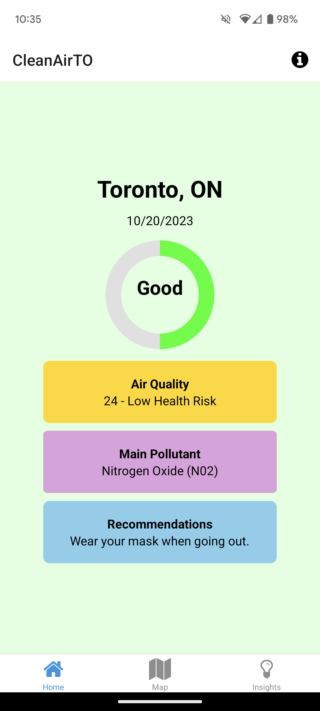
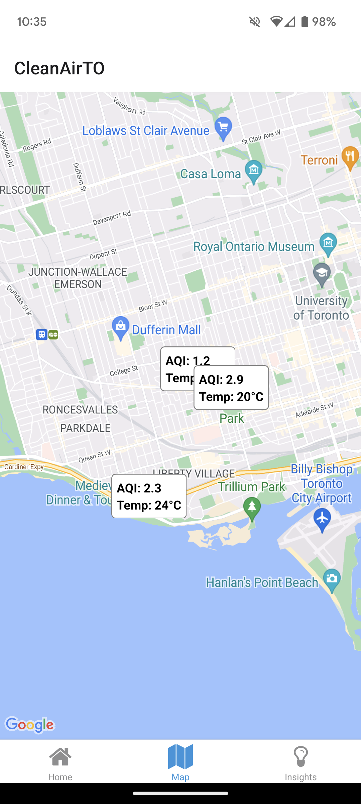
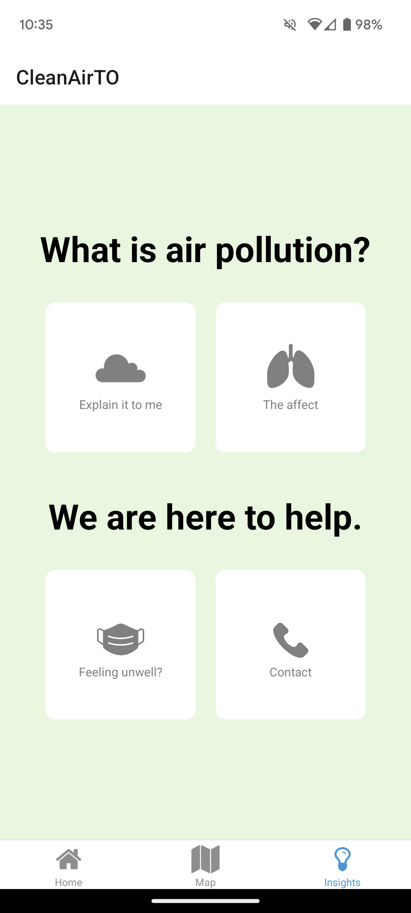

# CleanAirTO - West Toronto Ontario Health Organization Hackathon 2023 Project!

Introducing CleanAirTO, a mobile application that leverages real-time environmental data to provide users with a unique perspective of their surroundings. By seamlessly integrating Air Quality Index (AQI) and temperature metrics from Google Maps API and visualizing them on a map using react-native maps, our app offers a dynamic representation of the environment.

What sets CleanAirTO apart is its personalized approach. By utilizing a research-based questionnaire, the app tailors its insights to each user's pollution tolerance and risk level. Harnessing this valuable information, CleanAirTO algorithmically suggests precautionary measures based on the AQI, temperature, and individual risk profile.

Furthermore, users can access an extensive library of educational resources, empowering them to make informed decisions in their daily lives regarding air quality. CleanAirTO is not just an app; it's a comprehensive tool designed to enhance your understanding and choices in an ever-changing environment.

  
  
  

## Built with

- Framework: React Native
- Language: TypeScript

## Authors

- [Helen Luong](https://github.com/tdhluong) (www.linkedin.com/in/-helen-luong-)
- [J.Romero]
- [Chelsea]
